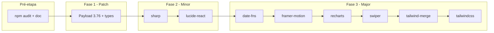

# Plano: atualização gradual de dependências (revisão com segurança)

Referência: [docs/DEPENDENCIAS_AUDIT_2025.md](DEPENDENCIAS_AUDIT_2025.md).  
Comando base: `npm install --legacy-peer-deps` (e `npm run build` após cada etapa).

---

## Revisão de segurança (resumo)

- **Baseline atual:** 8 vulnerabilidades moderadas (esbuild via drizzle-kit; undici via @vercel/blob). Nenhum fix disponível via `npm audit fix` (dependências transitivas).
- **Payload 3.76:** Versões ≥ 3.44.0 já incluem correções para CVE-2025-4643 (JWT não invalidado no logout) e CVE-2025-4644 (session fixation no adapter SQLite). Atualizar para 3.76 é **recomendado do ponto de vista de segurança**.
- **sharp ^0.34:** Sem CVEs conhecidos para 0.34.x; versões ≥ 0.32.6 corrigem CVE-2023-4863 (libwebp). Atualização **segura**.
- **lucide-react:** Pacote de ícones; sem histórico de vulnerabilidades críticas. Atualização de minor **baixo risco**.
- **Transitivas (esbuild/undici):** Após Fase 1, rodar `npm audit` novamente. Se as 8 moderadas persistirem, considerar **overrides** em `package.json` (ver secção “[Mitigações opcionais](#mitigações-opcionais)” abaixo) e testar bem — overrides podem introduzir incompatibilidades.
- **Ordem e rollback:** O fluxo (editar → install → build → testar → rollback se falhar) é **adequado** para segurança: evita que várias mudanças simultâneas dificultem identificar regressões ou efeitos colaterais.

---

## Ordem de execução



---

## Pré-etapa — Baseline de segurança

- **Ação:** Rodar `npm audit` e anotar o resultado (número de vulnerabilidades e pacotes afetados) em [docs/DEPENDENCIAS_AUDIT_2025.md](DEPENDENCIAS_AUDIT_2025.md) ou neste plano.
- **Objetivo:** Ter referência para comparar após cada fase e decidir se overrides são necessários.

---

## Fase 1 — Patch (baixo risco)

**Objetivo:** Payload 3.75 → 3.76 e @types/react 19.2.13 → 19.2.14.

- **Ação:** Em [package.json](../package.json), alterar versões para `^3.76.0` em: `payload`, `@payloadcms/db-postgres`, `@payloadcms/email-nodemailer`, `@payloadcms/next`, `@payloadcms/richtext-lexical`, `@payloadcms/storage-s3`, `@payloadcms/storage-vercel-blob`. E `@types/react` para `^19.2.14`.
- **Comando:** `npm install --legacy-peer-deps`
- **Teste:** `npm run build`; em seguida `npm run dev`, abrir admin Payload e uma página do site (ex.: home, blog).
- **Segurança:** Rodar `npm audit` após a Fase 1; verificar se alguma dependência transitiva (ex.: undici em `@payloadcms/storage-vercel-blob`) foi atualizada e se a contagem de vulnerabilidades mudou.
- **Rollback:** Reverter as linhas alteradas no `package.json` e rodar `npm install --legacy-peer-deps` de novo.

---

## Fase 2 — Minor (risco baixo)

Cada pacote em um passo separado: instalar, build, testar; se quebrar, reverter só esse.

| #   | Pacote           | Versão alvo | Onde é usado (referência)                     |
| --- | ---------------- | ----------- | --------------------------------------------- |
| 1   | **sharp**        | ^0.34.0     | Otimização de imagens (Next/Payload)          |
| 2   | **lucide-react** | ^0.563.0    | Ícones no projeto; checar se algum nome mudou |

Para cada um: atualizar a linha no `package.json`, `npm install --legacy-peer-deps`, `npm run build`. Se o build falhar ou houver erro visível (ex.: ícone sumindo), reverter esse pacote.

---

## Fase 3 — Major (um por um, com atenção a breaking changes)

Ordem sugerida (do menor impacto esperado ao maior):

| #   | Pacote             | De → Para        | Antes de atualizar                                                                                                                                     |
| --- | ------------------ | ---------------- | ------------------------------------------------------------------------------------------------------------------------------------------------------ |
| 1   | **tailwind-merge** | ^2.6.1 → ^3.4.0  | Checar [changelog](https://github.com/dcastil/tailwind-merge/releases); uso em `lib/utils.ts` / `cn()`                                                 |
| 2   | **date-fns**       | ^3.x → ^4.1.0    | Checar [releases](https://github.com/date-fns/date-fns/releases); buscar `date-fns` no código                                                          |
| 3   | **recharts**       | ^2.15.4 → ^3.7.0 | Checar [changelog](https://github.com/recharts/recharts/releases); usado em dashboard/gráficos                                                         |
| 4   | **framer-motion**  | ^11.x → ^12.x    | Checar [changelog](https://www.framer.com/motion/changelog/); animações no site                                                                        |
| 5   | **swiper**         | ^11.x → ^12.x    | Checar [migration guide](https://swiperjs.com/migration); carrosséis                                                                                    |
| 6   | **tailwindcss**    | ^3.4.x → ^4.x    | Maior impacto: [Tailwind v4 upgrade](https://tailwindcss.com/docs/upgrade-guide); pode exigir mudanças em `tailwind.config.ts`, `postcss`, classes CSS |

**Fluxo por pacote:** (1) Consultar changelog/migration. (2) Atualizar apenas esse pacote no `package.json`. (3) `npm install --legacy-peer-deps`. (4) `npm run build`. (5) Teste manual nas páginas que usam o pacote. (6) Se falhar: reverter esse pacote no `package.json`, rodar `npm install --legacy-peer-deps` e seguir para o próximo.

---

## Mitigações opcionais (vulnerabilidades transitivas)

Se após a Fase 1 o `npm audit` continuar reportando as mesmas 8 moderadas (esbuild, undici), pode-se avaliar **overrides** em `package.json`:

- **esbuild** (GHSA-67mh-4wv8-2f99): corrigido em esbuild ≥ 0.25.0. Exemplo de override:
  ```json
  "overrides": {
    "esbuild": ">=0.25.0"
  }
  ```
  Cadeia afetada: `@payloadcms/db-postgres` → drizzle-kit → @esbuild-kit → esbuild. Impacto principal em **dev** (dev server). Testar `payload migrate` e scripts que usem drizzle-kit.

- **undici** (GHSA-g9mf-h72j-4rw9): corrigido em undici ≥ 6.23.0. Exemplo de override:
  ```json
  "overrides": {
    "undici": ">=6.23.0"
  }
  ```
  Cadeia: `@payloadcms/storage-vercel-blob` → @vercel/blob → undici. Testar upload/leitura com Vercel Blob após aplicar.

**Atenção:** Overrides podem alterar o comportamento de dependências transitivas. Aplicar um de cada vez, rodar `npm install --legacy-peer-deps`, `npm run build` e testes manuais (admin, blog, storage) antes de manter.

---

## O que não atualizar (por decisão)

- **@types/node:** Manter `^20` (projeto usa Node 20; ver [.nvmrc](../.nvmrc) e `engines` no [package.json](../package.json)).

---

## Checklist pós-atualização

- [ ] `npm audit` — registrar resultado e comparar com o baseline; documentar em [docs/DEPENDENCIAS_AUDIT_2025.md](DEPENDENCIAS_AUDIT_2025.md).
- [ ] Atualizar [docs/DEPENDENCIAS_AUDIT_2025.md](DEPENDENCIAS_AUDIT_2025.md) com as versões finais aplicadas e qualquer breaking change resolvido (ex.: Tailwind v4, swiper 12).
- [ ] Se foram usados overrides, documentar quais e que testes foram feitos.

---

## Resumo de execução

1. **Pré-etapa:** `npm audit` → documentar baseline.
2. **Fase 1:** Editar `package.json` (Payload 3.76 + @types/react) → install → build → testar → `npm audit` novamente.
3. **Fase 2:** sharp → install → build → testar; lucide-react → idem.
4. **Fase 3:** Cada major um por um (tailwind-merge, date-fns, recharts, framer-motion, swiper, tailwindcss): editar → install → build → testar; em caso de falha, reverter só aquele pacote.
5. **Opcional:** Se vulnerabilidades transitivas persistirem, avaliar overrides (esbuild, undici) com testes.
6. **Final:** Atualizar documentação e checklist acima.

Em qualquer etapa, se o build ou o teste manual falhar, considerar rollback antes de seguir.
